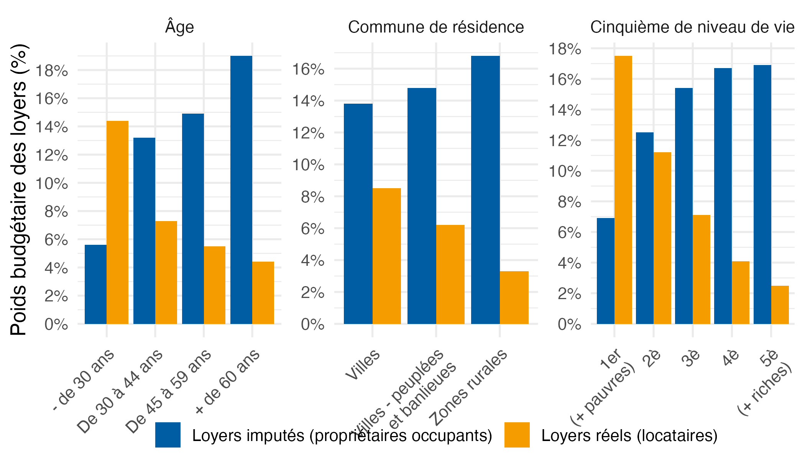

# L’analyse de l’inflation par catégories de ménages : quelques problèmes méthodologiques

Ce dépôt met à disposition des codes de réplication pour la [note en lien](https://fgeerolf.com/inflation-par-categorie.pdf).

## Graphique 5 : Poids budgétaire des loyers réels et des loyers imputés selon le type de ménage en 2020

[Code R](graphique5.R)

### Graphique 6 : Hausses de prix à la production sur quelques produits alimentaires sur les marques de Distributeur (MDD) et Marques Nationales (MN), entre octobre 2021 et octobre 2023

[Code R](graphique6.R)

